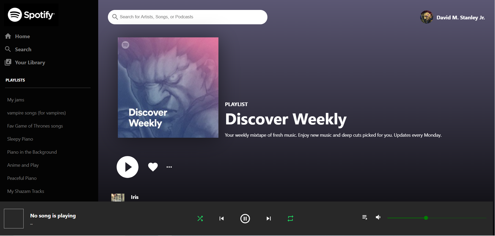
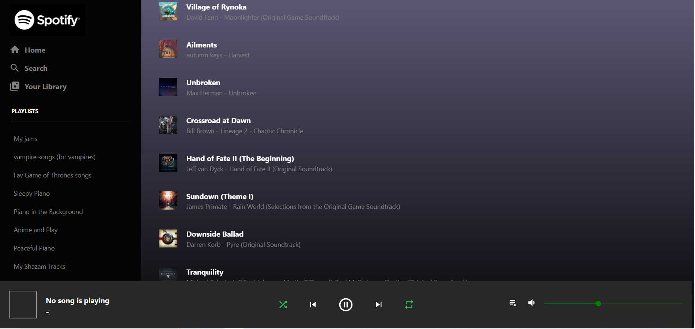
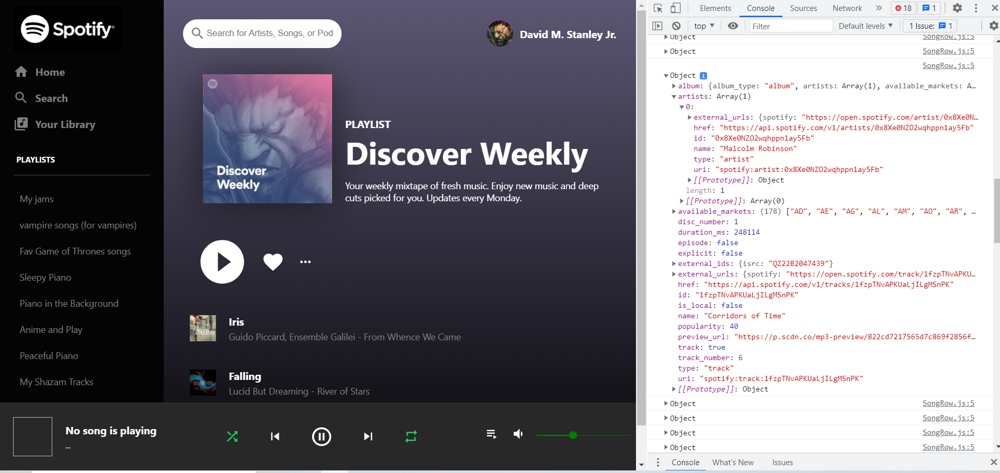
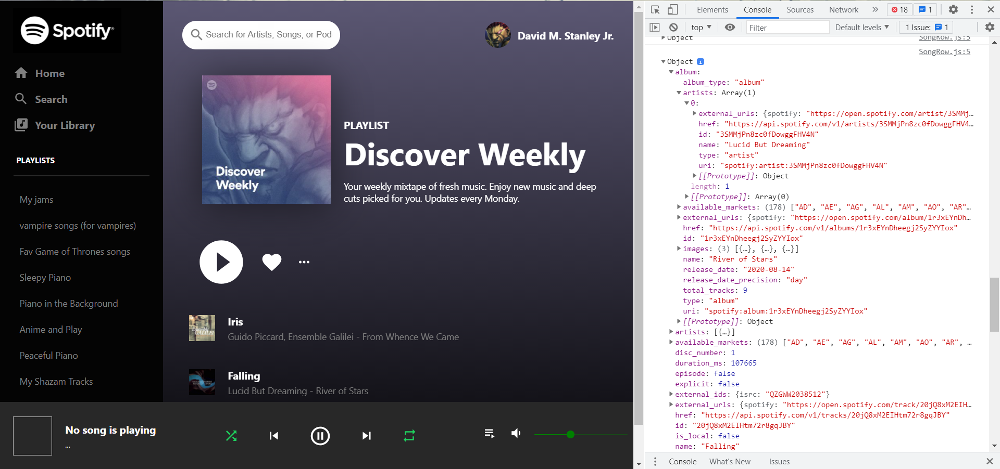

# spotify-clone

This is my attempt to improve upon what I did for my original spotify app. I wanted a project that plays music like my original project did but also looks like Spotify and pulls in images and playlists and everything. As of this moment, everything works accept for the play music part. The api allows me to pull in my username, avatar, playlists and discover weekly but I can't play music. I'm going to keep working on it until it does play music, but I have other projects I want to work on and will have to get back to this at a later date.

## Environment Setup

1. Clone my repo at https://github.com/davidmstanleyjr/spotify-clone

2. CD into it and run "npm install".

3. Then type "npm start".

## Technologies Used

1. React
2. Material UI
3. Spotify Web api

## Issues

Like I said, the app doesn't play music but does everything else. I'm able to login and pull user data like username, avatar and playlists but the songs don't play. I have to work on that. I had to use react context api to put certain things in a state where they could easily be used elsewhere in the application, similar to redux. That part worked out fine but I can't play music. I check the console and you can see the object that has all the data for the songs but I can't get it to play. That tells me i'm doing certain things right but it simply doesn't work yet. I'm sure I can get it because i'm really close but I have to move on to other things at the moment. I will have to figure this out later.

# Screenshots

Live Page

Here is a link to the deployed site. I hope you have fun with it.
https://davids-spotify-clone.vercel.app/
